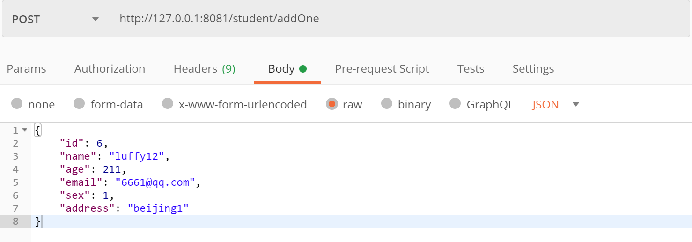
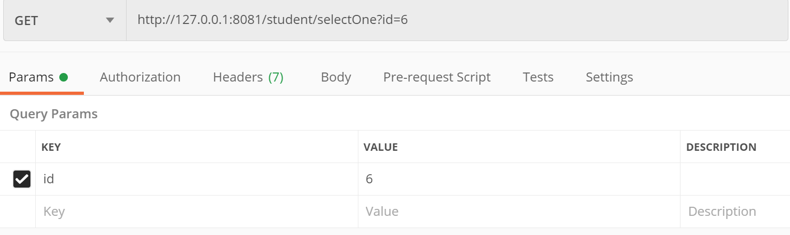
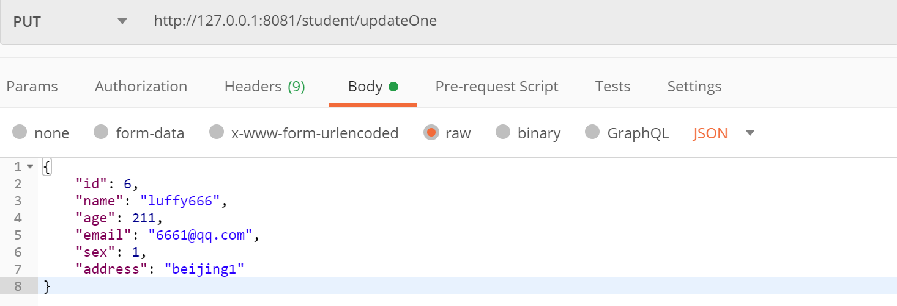
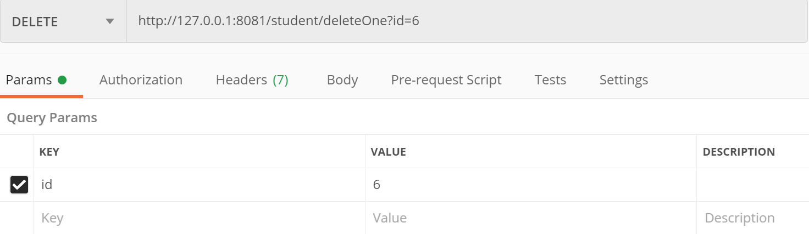

# 一、Spring Boot整合Cache介绍

&emsp;&emsp;Spring Boot整合Cache，实现缓存业务数据。

- RedisCacheManager结合RedisCache
- 自定义序列化实现方式
- 自定义RedisTemplate
- 自定义CacheManager并设置缓存过期时间，分为默认策略和定制策略
- 自定义KeyGenerator

# 二、前期准备

## 2.1 MySQL数据库准备:

- 对应的SQL见 /src/main/resources/sql/CreateTableSQL.sql
- 创建数据库TestDataBase
- 建表 - student(学生)
- MySQL配置信息见 /src/main/resources/application.properties

## 2.2 Redis数据库准备:

- Redis配置信息见 /src/main/resources/application.properties

## 2.3 PostMan测试工具准备:

- [下载地址](https://www.postman.com/)

# 三、测试信息

&emsp;&emsp;添加打印SQL信息配置，添加配置后**可以通过查看控制台是否打印SQL信息判断是否使用缓存或缓存是否过期。**

>logging.level.com.example.cache.dao=debug

&emsp;&emsp;创建数据：

&emsp;&emsp;查询数据：

&emsp;&emsp;更新数据：

&emsp;&emsp;删除数据：

